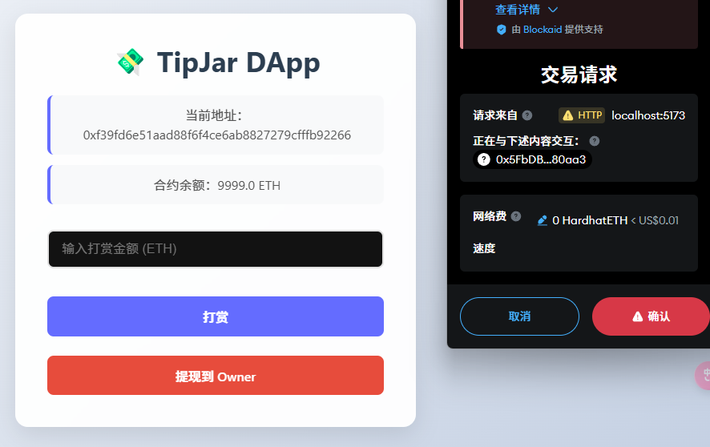

# TipJar DApp - Blockchain Tipping Application (Learning Project)

English | [中文版](./README.md)


## Project Overview

TipJar DApp is an Ethereum blockchain tipping application that allows users to send Ether as tips to creators, while creators can withdraw received tips. The application uses modern frontend technologies and smart contracts to provide a clean and intuitive user interface.

#### Interface


#### Withdrawal



#### Transaction Records


## Technology Stack

### Backend/Blockchain

- **Solidity**: Smart contract development language (v0.8.28)
- **Hardhat**: Ethereum development environment for compiling, testing, and deploying smart contracts
- **Ignition**: Hardhat deployment framework that simplifies smart contract deployment
- **Ethers.js**: JavaScript library for interacting with the Ethereum blockchain

### Frontend

- **React**: User interface library
- **CSS3**: Custom styling for modern UI design
- **Web3 Integration**: Connect to blockchain via wallets like MetaMask

## Core Features

### 1. Tipping Functionality

Users can connect their MetaMask wallet and send Ether as tips to the contract. The tipping process is transparent and secure, with all transaction records stored on the blockchain.

### 2. Withdrawal Functionality

The contract owner (creator) can withdraw received tips to their wallet address at any time. The withdrawal function is restricted to the contract owner only, ensuring fund security.

### 3. Balance Query

The application displays the current contract balance in real-time, allowing users and creators to monitor the tipping pool's financial status.

## Project Structure

```
tipjar-dapp/
├── contracts/            # Solidity smart contracts
│   └── TipJar.sol        # Tipping contract
├── frontend/             # React frontend application
│   └── src/              # Source code
│       ├── App.jsx       # Main application component
│       ├── App.css       # Stylesheet
│       ├── constants.js  # Constants configuration
│       └── abi/          # Contract ABI
├── ignition/             # Deployment configuration
│   └── modules/          # Deployment modules
├── test/                 # Test files
└── hardhat.config.js     # Hardhat configuration
```

## Getting Started

### Install Dependencies

```bash
npm install
```

### Compile Contracts

```bash
npx hardhat compile
```

### Deploy Contracts

```bash
npx hardhat ignition deploy ignition/modules/TipJar.js
```

### Start Frontend

```bash
cd frontend
npm install
npm run dev
```

## Testing

```bash
npx hardhat test
```

## Contributing

Contributions via Issues and Pull Requests to improve this project are welcome.

## License

MIT
