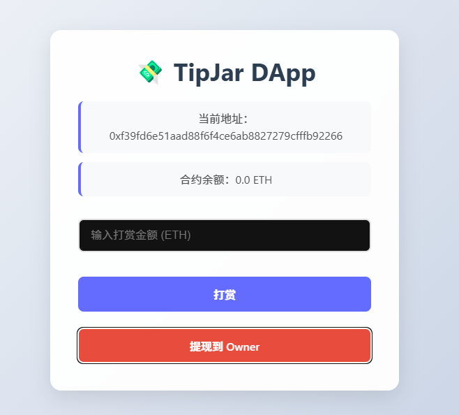
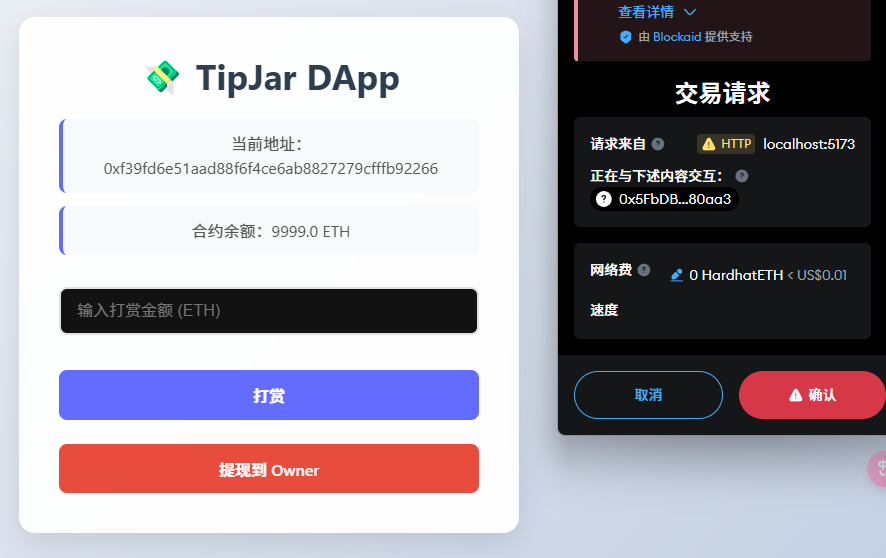
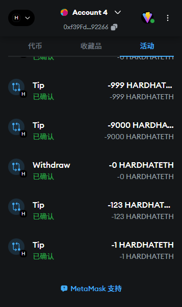

# TipJar DApp - 区块链打赏应用（学习项目）


## 项目简介

TipJar DApp 以太坊区块链的打赏应用，允许用户向创作者发送以太币作为打赏，同时创作者可以提取收到的打赏。该应用采用了现代前端技术和智能合约，提供了简洁直观的用户界面。

#### 界面



#### 提现



#### 记录




## 技术栈

### 后端/区块链

- **Solidity**: 智能合约开发语言 (v0.8.28)
- **Hardhat**: 以太坊开发环境，用于编译、测试和部署智能合约
- **Ignition**: Hardhat 部署框架，简化智能合约部署流程
- **Ethers.js**: JavaScript 库，用于与以太坊区块链交互

### 前端

- **React**: 用户界面库
- **CSS3**: 自定义样式，实现现代化 UI 设计
- **Web3 集成**: 通过 MetaMask 等钱包连接区块链

## 核心功能

### 1. 打赏功能

用户可以通过连接 MetaMask 钱包，向合约发送以太币作为打赏。打赏过程透明、安全，所有交易记录均保存在区块链上。

### 2. 提现功能

合约所有者（创作者）可以随时将收到的打赏提取到自己的钱包地址。提现功能仅限合约所有者使用，确保资金安全。

### 3. 余额查询

应用实时显示合约当前余额，让用户和创作者随时了解打赏池中的资金状况。

## 项目结构

```
tipjar-dapp/
├── contracts/            # Solidity 智能合约
│   └── TipJar.sol        # 打赏合约
├── frontend/             # React 前端应用
│   └── src/              # 源代码
│       ├── App.jsx       # 主应用组件
│       ├── App.css       # 样式文件
│       ├── constants.js  # 常量配置
│       └── abi/          # 合约 ABI
├── ignition/             # 部署配置
│   └── modules/          # 部署模块
├── test/                 # 测试文件
└── hardhat.config.js     # Hardhat 配置
```

## 开始使用

### 安装依赖

```bash
npm install
```

### 编译合约

```bash
npx hardhat compile
```

### 部署合约

```bash
npx hardhat ignition deploy ignition/modules/TipJar.js
```

### 启动前端

```bash
cd frontend
npm install
npm run dev
```

## 测试

```bash
npx hardhat test
```

## 贡献

欢迎提交 Issues 和 Pull Requests 来改进这个项目。

## 许可证

MIT
